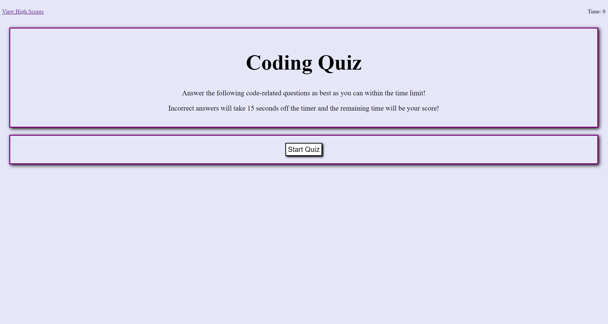

# coding-quiz

## Description

Test your coding skills with this short quiz. You can also come back and see your previous scores.

## Table of Contents

- [Installation](#installation)
- [Usage](#usage)
- [Credits](#credits)
- [License](#license)

## Installation

You can reach this webpage through any web browser. No installation is required.

## Usage

Click the button "Start Quiz" and the questions will start to appear. There is a timer and the timer will go down 15 seconds every time you answer a question wrong. The remaining time in the end will be the score.

## Credits

- Rutgers University Coding Bootcamp
- [w3schools.com](W3schools.com)

## License

N/A